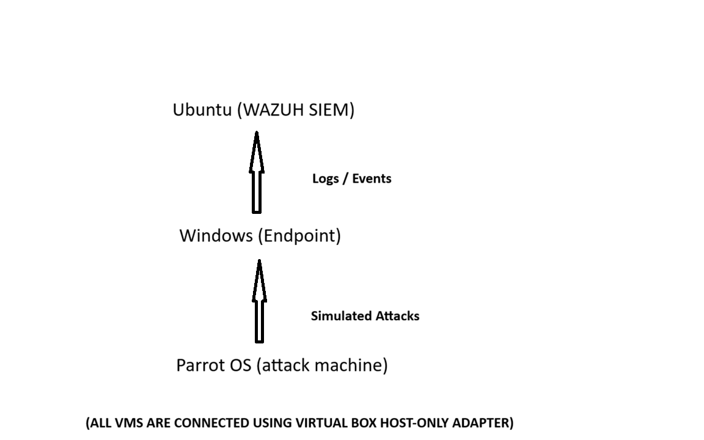

# SOC Home Lab (Wazuh)

This repository documents a personal SOC home lab built to understand
basic SIEM operations, Windows event logging, and MITRE ATT&CK mapping.

## Lab Architecture

**Components:**
- Ubuntu SIEM running Wazuh
- Windows 10 endpoint (Wazuh agent installed)
- Parrot OS for controlled attack simulations

## Example Detection

The screenshot above shows a Windows security event mapped to a
MITRE ATT&CK tactic (Defense Evasion) after enabling audit policies.

## What I Learned
- Importance of proper Windows auditing configuration
- How endpoint events flow into a SIEM
- Why alert context matters in SOC analysis

## Notes
This is a learning lab built in a virtualized environment.
No real-world systems were involved.
